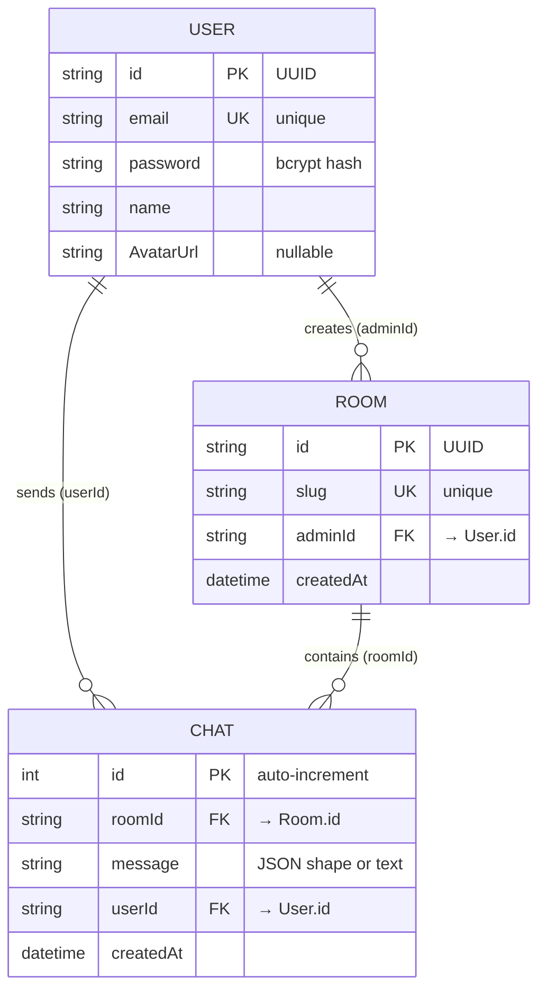

<p align="center">
  
</p>

<h1 align="center">Draftr</h1>

<p align="center">
  <b>Real-time collaborative whiteboard & chat application</b><br/>
  <i>Sketch ideas together — powered by WebSockets, Canvas API, and a scalable Turborepo monorepo architecture.</i>
</p>

<p align="center">
  
  
  
  
  
  
  
</p>

---

## Table of Contents

- [What is Draftr?](#what-is-draftr)
- [What Does It Do?](#what-does-it-do)
- [Real-Life Use Cases](#real-life-use-cases)
- [Core Functionalities](#core-functionalities)
- [Tech Stack](#tech-stack)
- [System Architecture](#system-architecture)
  - [High-Level Architecture](#high-level-architecture)
  - [WebSocket (WS) Backend Architecture](#websocket-ws-backend-architecture)
  - [HTTP Backend Architecture](#http-backend-architecture)
  - [Database Architecture](#database-architecture)
  - [Frontend Architecture](#frontend-architecture)
- [Database Schema](#database-schema)
- [Folder Structure](#folder-structure)
- [Local Setup & Replication](#local-setup--replication)
- [Environment Variables](#environment-variables)
- [API Endpoints](#api-endpoints)
- [WebSocket Message Protocol](#websocket-message-protocol)
- [License](#license)

---

## What is Draftr?

**Draftr** is a full-stack, real-time collaborative whiteboard and chat application built as a **Turborepo monorepo**. It allows multiple users to create private or shared rooms, draw shapes (rectangles, circles, lines, text) on an HTML5 Canvas, and exchange chat messages — all synchronized instantly across every connected client via WebSockets.

Think of it as a self-hosted, developer-friendly alternative to tools like Excalidraw or Miro, purpose-built for engineering teams, product designers, and visual thinkers who need a low-latency, no-frills sketching surface for brainstorming sessions, architecture reviews, and sprint retrospectives.

---

## What Does It Do?

| Capability | Description |
|---|---|
| **User Authentication** | Email/password sign-up & sign-in with bcrypt-hashed passwords and JWT-based session tokens. |
| **Room Management** | Create named rooms with unique slugs, join existing rooms by code, and list recent whiteboards. |
| **Real-Time Drawing** | Draw rectangles, circles, lines, and text on an HTML5 Canvas with live preview while dragging. |
| **Instant Sync** | Every shape drawn by one user is broadcast to all other users in the same room via WebSockets in real time. |
| **Persistent Canvas** | All shapes are stored as serialized JSON messages in the database, so the canvas is fully restored when re-joining a room. |
| **Real-Time Chat** | Send and receive text messages within a room, persisted to PostgreSQL for chat history retrieval. |
| **Multi-Room Support** | A single WebSocket connection can subscribe to multiple rooms simultaneously. |

---

## Real-Life Use Cases

### 1. 🏗️ Architecture Design Sessions
Engineering teams can spin up a Draftr room during a design meeting, draw system architecture diagrams (microservices, databases, API gateways) in real time, and have every participant see strokes the instant they are made — no screen-sharing lag.

### 2. 🎨 UX/UI Wireframing
Product designers can sketch low-fidelity wireframes collaboratively, iterate on user flow diagrams, and annotate designs with the text tool — all from the browser without installing heavyweight design software.

### 3. 🔄 Sprint Retrospectives
Scrum teams can use rooms as virtual sticky-note boards, writing text items for "What went well", "What didn't", and "Action items" while seeing each other's input live, replacing physical whiteboards.

### 4. 📚 Online Teaching & Tutoring
Educators can create a room, share the room code with students, and draw diagrams, equations, or concept maps while students follow along and contribute in real time.

### 5. 💬 Team Chat Rooms
Beyond the canvas, Draftr doubles as a real-time chat platform where team members can exchange messages within project-specific rooms, with full chat history persistence.

### 6. 🧩 Remote Pair Programming
Developers can sketch out algorithm flowcharts, database schemas, or API contracts on the canvas while discussing over a separate voice channel, replacing crude screen-sharing for visual collaboration.

---

## Core Functionalities

### Authentication & Authorization
- **Sign Up** — Create an account with email, name, and password (validated via Zod schemas; password hashed with bcrypt, salt rounds = 5).
- **Sign In** — Authenticate with email/password, receive a JWT token stored in `localStorage`.
- **JWT Middleware** — Protected routes extract and verify the JWT from the `Authorization` header; WebSocket connections authenticate via a `?token=` query parameter.

### Room Management
- **Create Room** — Authenticated users create a room with a unique slug name (5–15 characters). The creator becomes the room admin.
- **Join Room** — Enter a room slug to resolve its `roomId` and join the canvas/chat.
- **List Rooms** — Fetch the 3 most recently created rooms (paginated).
- **Room Lookup** — Resolve a room slug to its full room object (id, slug, adminId, createdAt).

### Real-Time Canvas (Drawing Engine)
- **Shape Tools** — Rectangle, Circle, Line, and Text tools with live preview during drag.
- **`Game` Class** — An OOP-based drawing engine that manages canvas state, mouse event handlers, shape rendering, and WebSocket message dispatch.
- **Shape Persistence** — Shapes are serialized as JSON strings, sent as WebSocket `Send_Message` events, and stored in the `Chat` table. On room entry, all prior shapes are fetched and re-rendered.
- **Canvas Resize** — Automatic full-viewport canvas sizing with proper coordinate mapping via `getBoundingClientRect()`.

### Real-Time Communication (WebSocket)
- **Connection** — Clients connect to `ws://localhost:8000?token=<JWT>` and are authenticated server-side.
- **Room Subscription** — Clients send `join_room` / `Leave_Room` messages to subscribe/unsubscribe from room broadcasts.
- **Message Broadcast** — `Send_Message` events are broadcast to every client in the same room and persisted to the database.

### Chat System
- **Send Messages** — Chat messages sent via WebSocket are broadcast and stored.
- **Chat History** — REST endpoint fetches the last 1,000 messages for a room (ordered by most recent), used to hydrate the UI on room join.

---

## Tech Stack

| Layer | Technology | Purpose |
|---|---|---|
| **Monorepo** | [Turborepo](https://turbo.build/) + [pnpm Workspaces](https://pnpm.io/workspaces) | Orchestrates builds, dev servers, and shared packages across the monorepo |
| **Frontend (Primary)** | [Next.js 16](https://nextjs.org/) + [React 19](https://react.dev/) + [Tailwind CSS 4](https://tailwindcss.com/) | `draftr-frontend` — the polished landing page, dashboard, auth forms, and canvas |
| **Frontend (Prototype)** | [Next.js 16](https://nextjs.org/) + React 19 | `web` — the initial prototype with basic chat-only functionality |
| **HTTP Backend** | [Express 5](https://expressjs.com/) + TypeScript | REST API for auth, room CRUD, and chat history |
| **WebSocket Backend** | [ws](https://github.com/websockets/ws) (native WebSocket library) | Real-time bidirectional communication for canvas sync and chat |
| **ORM** | [Prisma](https://www.prisma.io/) | Type-safe database client with migrations |
| **Database** | [PostgreSQL](https://www.postgresql.org/) (hosted on [Neon](https://neon.tech/)) | Persistent storage for users, rooms, and chat/shape data |
| **Authentication** | [jsonwebtoken](https://github.com/auth0/node-jsonwebtoken) + [bcrypt](https://github.com/kelektiv/node.bcrypt.js) | JWT-based stateless auth with bcrypt password hashing |
| **Validation** | [Zod 4](https://zod.dev/) | Runtime schema validation for API request bodies |
| **Icons** | [Lucide React](https://lucide.dev/) | Modern, lightweight SVG icon library |
| **Analytics** | [Vercel Analytics](https://vercel.com/analytics) | Page-view and web-vitals tracking |
| **Language** | [TypeScript 7](https://www.typescriptlang.org/) | End-to-end type safety across all apps and packages |

---

## System Architecture

### High-Level Architecture

```
┌──────────────────────────────────────────────────────────────────────────┐
│                              CLIENT BROWSER                              │
│                                                                          │
│  ┌────────────────────────┐       ┌────────────────────────────────────┐ │
│  │  draftr-frontend        │       │  web (prototype)                   │ │
│  │  (Next.js 16 + TW4)    │       │  (Next.js 16)                      │ │
│  │                          │       │                                    │ │
│  │  • Landing Page          │       │  • Basic Chat UI                   │ │
│  │  • Sign In / Sign Up     │       │  • Room Join                       │ │
│  │  • Dashboard             │       │  • ChatRoomClient (WS)             │ │
│  │  • Canvas (Game Engine)  │       │                                    │ │
│  └──────────┬───────────────┘       └──────────┬───────────────────────┘ │
│             │ HTTP (REST)                       │ HTTP (REST)            │
│             │ WebSocket (WS)                    │ WebSocket (WS)        │
└─────────────┼───────────────────────────────────┼───────────────────────┘
              │                                   │
     ┌────────▼────────────────────────────────────▼──────────┐
     │                  BACKEND SERVERS                        │
     │                                                         │
     │   ┌─────────────────────┐   ┌─────────────────────────┐│
     │   │  HTTP Backend        │   │  WebSocket Backend       ││
     │   │  (Express 5)         │   │  (ws library)            ││
     │   │  Port: 5000          │   │  Port: 8000              ││
     │   │                      │   │                          ││
     │   │  • POST /signUp      │   │  • Token auth on connect ││
     │   │  • POST /signIn      │   │  • join_room             ││
     │   │  • POST /createRooms │   │  • Leave_Room            ││
     │   │  • GET  /chats/:id   │   │  • Send_Message          ││
     │   │  • GET  /room/:slug  │   │  (broadcast + persist)   ││
     │   │  • GET  /rooms/all   │   │                          ││
     │   └──────────┬───────────┘   └──────────┬──────────────┘│
     │              │                           │               │
     │              └───────────┬───────────────┘               │
     │                          │                               │
     │                 ┌────────▼────────────┐                  │
     │                 │   Prisma ORM         │                  │
     │                 │   (Singleton Client)  │                  │
     │                 └────────┬────────────┘                  │
     │                          │                               │
     └──────────────────────────┼───────────────────────────────┘
                                │
                       ┌────────▼────────────┐
                       │   PostgreSQL (Neon)   │
                       │                      │
                       │  • User table         │
                       │  • Room table         │
                       │  • Chat table         │
                       └──────────────────────┘
```

---

### WebSocket (WS) Backend Architecture

The WebSocket server handles all real-time communication. Here's how it works:

```
Client connects → ws://localhost:8000?token=<JWT>
        │
        ▼
┌──────────────────────────┐
│  Token Validation         │
│  jwt.verify(token, SECRET)│
│  Extract userId           │
└───────────┬──────────────┘
            │ valid?
      ┌─────┴─────┐
      │ YES       │ NO → ws.close()
      ▼           │
┌─────────────────┐
│  Add to Users[] │   In-memory array: { UserId, rooms[], ws }
└────────┬────────┘
         │
         ▼
    ws.on("message")
         │
    ┌────┴────────────────────┐──────────────────────┐
    │                         │                      │
    ▼                         ▼                      ▼
"join_room"             "Leave_Room"          "Send_Message"
    │                         │                      │
    ▼                         ▼                      ▼
Add roomId to           Remove roomId         1. Broadcast message
user's rooms[]          from rooms[]             to all users in room
                                              2. prisma.chat.create()
                                                 (persist to DB)
```

**Key Design Decisions:**
- **In-memory user store** — Active connections are tracked in a `Users[]` array with their socket reference, userId, and subscribed room IDs.
- **Fan-out broadcast** — On `Send_Message`, the server iterates all users, checks if their `rooms[]` includes the target `roomId`, and sends via their WebSocket.
- **Dual-write** — Messages are both broadcast and persisted to PostgreSQL in the same handler for consistency.

---

### HTTP Backend Architecture

The Express server handles RESTful operations: authentication, room management, and chat history retrieval.

```
┌──────────────────────────────────────────────────────────────┐
│                      Express 5 Server (Port 5000)             │
│                                                                │
│  Middleware Stack:                                              │
│  ├── express.json()          (body parsing)                    │
│  ├── cors()                  (cross-origin requests)           │
│  └── middleware()            (JWT auth for protected routes)   │
│                                                                │
│  Routes:                                                       │
│  ├── POST /signUp            [Public]   → Create user          │
│  ├── POST /signIn            [Public]   → Authenticate + JWT   │
│  ├── POST /app/createRooms   [Auth]     → Create room          │
│  ├── GET  /chats/:roomId     [Public]   → Fetch chat history   │
│  ├── GET  /room/:slug        [Public]   → Resolve slug → room  │
│  └── GET  /rooms/all         [Auth]     → List recent rooms    │
│                                                                │
│  Auth Middleware Flow:                                          │
│  req.headers["authorization"] → jwt.verify() → req.UserId      │
└──────────────────────────────────────────────────────────────┘
```

**Validation Flow (Zod):**
```
Request Body → Zod Schema.safeParse() → Valid? → Process
                                        Invalid? → 422 Response
```

---

### Database Architecture

```
┌────────────────────────────────────────────────┐
│            packages/Database                     │
│                                                  │
│  ┌──────────────┐    ┌──────────────────────┐   │
│  │ schema.prisma │───▶│ prisma generate       │   │
│  │               │    │ → generated/client/   │   │
│  └──────────────┘    └──────────┬───────────┘   │
│                                  │               │
│  ┌──────────────┐               │               │
│  │ db.mts        │◀──────────────┘               │
│  │               │                               │
│  │ Singleton     │                               │
│  │ PrismaClient  │──────▶ PostgreSQL (Neon)      │
│  └──────────────┘                               │
│                                                  │
│  Exported as: @repo/database/db                  │
│  Used by: http-backend, ws-backend               │
└────────────────────────────────────────────────┘
```

The database package uses a **singleton pattern** to prevent multiple Prisma client instances during development hot-reloads:

```typescript
const prisma = globalThis.prismaGlobal ?? prismaClientSingleton();
```

---

### Frontend Architecture

#### `draftr-frontend` (Primary Application)

```
Landing Page (/)
    │
    ├── /signin  ────────▶ POST /signIn → JWT → localStorage
    ├── /signup  ────────▶ POST /signUp → Account creation
    │
    └── /dashboard ──────▶ Create Room (POST /app/createRooms)
         │                  Join Room (navigate to /canvas/:slug)
         │
         └── /canvas/:slug ──▶ Server Component: resolve slug → roomId
                │
                └── Playground Component
                     │
                     ├── WebSocket connect (WS_URL?token=JWT)
                     ├── Send join_room { roomId }
                     │
                     └── Rooms Component (Canvas)
                          │
                          ├── Game class instantiation
                          ├── Fetch existing shapes (GET /chats/:roomId)
                          ├── Render shapes on Canvas
                          ├── Mouse event handlers (draw + preview)
                          ├── WebSocket send (shape data)
                          └── WebSocket receive (render incoming shapes)
```

**Drawing Engine (`Game` class):**
- Uses the HTML5 Canvas 2D API for rendering.
- Maintains an `ExistingShapes[]` array as the source of truth.
- On every shape addition (local draw or remote receive), the canvas is fully cleared and all shapes are re-rendered (immediate-mode rendering).
- Supports: `rect`, `circle`, `line`, and `text` shape types.
- Text tool spawns a temporary `<input>` element overlay on the canvas for inline editing.

---

## Database Schema

The database uses **3 core models** with PostgreSQL as the underlying provider:

```prisma
// ─── User ───────────────────────────────────────────────
model User {
  id        String   @id @default(uuid())    // UUID primary key
  email     String   @unique                 // Unique email address
  password  String                           // bcrypt-hashed password
  name      String                           // Display name
  AvatarUrl String?                          // Optional avatar URL
  rooms     Room[]                           // Rooms created by this user
  chats     Chat[]                           // Messages sent by this user
}

// ─── Room ───────────────────────────────────────────────
model Room {
  id        String   @id @default(uuid())    // UUID primary key
  slug      String   @unique                 // Human-readable room name/code
  adminId   String                           // FK → User.id (room creator)
  admin     User     @relation(...)          // Relation to admin user
  chats     Chat[]                           // Messages/shapes in this room
  createdAt DateTime @default(now())         // Creation timestamp
}

// ─── Chat ───────────────────────────────────────────────
model Chat {
  id        Int      @id @default(autoincrement())  // Auto-increment PK
  roomId    String                                   // FK → Room.id
  room      Room     @relation(...)                  // Relation to room
  message   String                                   // JSON-serialized shape or text message
  userId    String                                   // FK → User.id (sender)
  users     User     @relation(...)                  // Relation to sender
  createdAt DateTime @default(now())                 // Timestamp
}
```

### Entity-Relationship Diagram



### Shape Message Formats (stored in `Chat.message`)

| Shape | JSON Structure |
|---|---|
| **Rectangle** | `{ "type": "rect", "x": 100, "y": 50, "width": 200, "height": 150 }` |
| **Circle** | `{ "type": "circle", "centerx": 300, "centery": 200, "radius": 80 }` |
| **Line** | `{ "type": "line", "startX": 10, "startY": 20, "endX": 300, "endY": 400 }` |
| **Text** | `{ "type": "text", "content": "Hello", "x": 50, "y": 100, "fontSize": 20, "fontFamily": "sans-serif" }` |

---

## Folder Structure

```
draftr/
├── apps/
│   ├── draftr-frontend/              # 🎨 Primary frontend (polished UI)
│   │   ├── app/
│   │   │   ├── page.tsx              #   Landing page with hero, features, CTA
│   │   │   ├── layout.tsx            #   Root layout (Inter font, metadata, analytics)
│   │   │   ├── globals.css           #   Global styles + CSS custom properties
│   │   │   ├── config.ts             #   BACKEND_URL & WS_URL constants
│   │   │   ├── signin/page.tsx       #   Sign-in form
│   │   │   ├── signup/page.tsx       #   Sign-up form
│   │   │   ├── dashboard/page.tsx    #   Dashboard: create/join rooms, recent boards
│   │   │   ├── canvas/[slug]/page.tsx#   Server component: resolve slug → Playground
│   │   │   ├── Playground/page.tsx   #   WebSocket connection + room join orchestrator
│   │   │   ├── Rooms/page.tsx        #   Canvas component with Game engine + toolbar
│   │   │   └── Components/          #   Shared UI components
│   │   ├── draw/
│   │   │   ├── index.ts             #   Functional drawing API (legacy)
│   │   │   ├── game.ts              #   Game class — OOP drawing engine
│   │   │   └── https.ts             #   HTTP helper for fetching shapes
│   │   ├── package.json
│   │   ├── next.config.ts
│   │   └── postcss.config.mjs
│   │
│   ├── web/                          # 💬 Prototype frontend (chat-focused)
│   │   ├── app/
│   │   │   ├── page.tsx              #   Home page with room slug input
│   │   │   ├── layout.tsx            #   Root layout
│   │   │   ├── config.ts             #   Backend URL constants
│   │   │   ├── SignUp/page.tsx       #   Sign-up page
│   │   │   ├── SignIn/page.tsx       #   Sign-in page
│   │   │   ├── Dashboard/page.tsx    #   Join/Create room buttons
│   │   │   ├── CreateRoom/page.tsx   #   Create room form
│   │   │   ├── JoinRoom/page.tsx     #   Join room form
│   │   │   ├── Rooms/[Slug]/page.tsx #   Dynamic room page with ChatRoom
│   │   │   ├── Components/
│   │   │   │   ├── ChatRoom.tsx      #   Server component: fetch messages
│   │   │   │   └── ChatRoomClient.tsx#   Client component: WS chat + message list
│   │   │   └── Functions/
│   │   │       └── function.ts       #   Utility: resolve room slug → roomId
│   │   ├── Hooks/
│   │   │   └── useSocket.ts          #   Custom React hook for WebSocket connection
│   │   └── package.json
│   │
│   ├── http-backend/                 # 🌐 REST API server
│   │   ├── src/
│   │   │   ├── index.mts             #   Express app: routes, middleware, server start
│   │   │   └── Middleware/
│   │   │       └── middleware.mts    #   JWT authentication middleware
│   │   ├── package.json
│   │   └── tsconfig.json
│   │
│   └── ws-backend/                   # ⚡ WebSocket server
│       ├── src/
│       │   ├── index.mts             #   WS server: connection, room mgmt, broadcast
│       │   ├── Interface/
│       │   │   └── index.mts         #   TypeScript interface for User type
│       │   └── TokenValidation/
│       │       └── token.mts         #   JWT token verification helper
│       ├── package.json
│       └── tsconfig.json
│
├── packages/
│   ├── Database/                     # 🗄️ Prisma ORM & database client
│   │   ├── prisma/
│   │   │   ├── schema.prisma         #   Database schema (User, Room, Chat)
│   │   │   └── migrations/           #   Prisma migration files
│   │   ├── src/
│   │   │   ├── db.mts                #   Singleton PrismaClient export
│   │   │   └── generated/            #   Auto-generated Prisma client
│   │   ├── .env                      #   DATABASE_URL (PostgreSQL connection string)
│   │   └── package.json              #   @repo/database
│   │
│   ├── common/                       # 📋 Shared Zod validation schemas
│   │   ├── src/
│   │   │   └── types.mts             #   SignUpSchema, SignInSchema, CreateRoomSchema
│   │   └── package.json              #   @repo/common
│   │
│   ├── backends-common/              # 🔐 Shared backend config (JWT secret)
│   │   ├── src/
│   │   │   └── index.mts             #   JWT_SECRET export
│   │   └── package.json              #   @repo/common-backend
│   │
│   ├── StatusCodes/                  # 📊 HTTP status code constants
│   │   ├── src/
│   │   │   └── statuscodes.mts       #   SuccessStatusCodes, ClientErrorStatusCodes, ServerErrors
│   │   └── package.json              #   @repo/statuscodes
│   │
│   ├── ui/                           # 🧩 Shared React component library (stub)
│   │   ├── src/
│   │   └── package.json              #   @repo/ui
│   │
│   ├── eslint-config/                # 🔍 Shared ESLint configuration
│   └── typescript-config/            # ⚙️ Shared tsconfig.json presets
│
├── package.json                      # Root workspace config
├── pnpm-workspace.yaml               # pnpm workspace definition
├── turbo.json                        # Turborepo pipeline configuration
└── .gitignore
```

---

## Local Setup & Replication

### Prerequisites

| Tool | Minimum Version |
|---|---|
| [Node.js](https://nodejs.org/) | `>= 24.x` |
| [pnpm](https://pnpm.io/) | `11.25.0+` |
| [PostgreSQL](https://www.postgresql.org/) | Any (local or cloud via [Neon](https://neon.tech/)) |

### Step 1: Clone the Repository

```bash
git clone https://github.com/<your-username>/draftr.git
cd draftr
```

### Step 2: Install Dependencies

```bash
pnpm install
```

### Step 3: Configure Environment Variables

Create or update the `.env` file in `packages/Database/`:

```bash
# packages/Database/.env
DATABASE_URL="postgresql://<user>:<password>@<host>/<database>?sslmode=require"
```

> **Tip:** You can get a free PostgreSQL database from [Neon](https://neon.tech/) in under a minute.

### Step 4: Run Prisma Migrations

```bash
cd packages/Database
npx prisma migrate dev --name init
npx prisma generate
cd ../..
```

### Step 5: Build Shared Packages

```bash
pnpm run build
```

### Step 6: Start All Services (Development)

```bash
pnpm run dev
```

This starts all apps concurrently via Turborepo:

| Service | URL | Description |
|---|---|---|
| `draftr-frontend` | `http://localhost:3000` | Primary frontend (canvas + auth + dashboard) |
| `web` | `http://localhost:3001` | Prototype frontend (chat-only) |
| `http-backend` | `http://localhost:5000` | REST API server |
| `ws-backend` | `ws://localhost:8000` | WebSocket server |

### Starting Individual Services

```bash
# Start only the primary frontend
pnpm exec turbo dev --filter=draftr-frontend

# Start only the HTTP backend
pnpm exec turbo dev --filter=http-backend

# Start only the WebSocket backend
pnpm exec turbo dev --filter=ws-backend
```

---

## Environment Variables

| Variable | Location | Description |
|---|---|---|
| `DATABASE_URL` | `packages/Database/.env` | PostgreSQL connection string |
| `JWT_SECRET` | `packages/backends-common/src/index.mts` | JWT signing secret (hardcoded — move to `.env` for production) |
| `BACKEND_URL` | `apps/*/app/config.ts` | HTTP backend URL (`http://localhost:5000`) |
| `WS_URL` | `apps/*/app/config.ts` | WebSocket server URL (`ws://localhost:8000`) |

---

## API Endpoints

### Public Endpoints

| Method | Endpoint | Body | Response | Description |
|---|---|---|---|---|
| `POST` | `/signUp` | `{ email, name, password }` | `201` — `{ msg }` | Create a new user account |
| `POST` | `/signIn` | `{ email, password }` | `200` — `{ token }` | Authenticate and receive JWT |
| `GET` | `/chats/:roomId` | — | `200` — `{ Chats[] }` | Fetch last 1000 messages for a room |
| `GET` | `/room/:slug` | — | `200` — `{ room }` | Resolve a room slug to its full object |

### Authenticated Endpoints (requires `Authorization` header with JWT)

| Method | Endpoint | Body | Response | Description |
|---|---|---|---|---|
| `POST` | `/app/createRooms` | `{ RoomName }` | `200` — `{ data: roomId }` | Create a new room |
| `GET` | `/rooms/all` | — | `200` — `{ Rooms[] }` | List 3 most recent rooms |

---

## WebSocket Message Protocol

### Client → Server

```jsonc
// Join a room
{ "type": "join_room", "roomId": "<room-uuid>" }

// Leave a room
{ "type": "Leave_Room", "roomId": "<room-uuid>" }

// Send a message (text chat or serialized shape)
{ "type": "Send_Message", "message": "<string>", "roomId": "<room-uuid>" }
```

### Server → Client

```jsonc
// Broadcast received message to all room subscribers
{ "type": "Send_Message", "message": "<string>" }
```

> **Note:** The `message` field for shapes is a **JSON-stringified** shape object (e.g., `"{\"type\":\"rect\",\"x\":10,...}"`). The client parses this string to reconstruct the shape.

---

## License

This project is for educational and personal use. All rights reserved.

---

<p align="center">
  Built with ❤️ by <b>Bhavesh Joshi</b>
</p>
